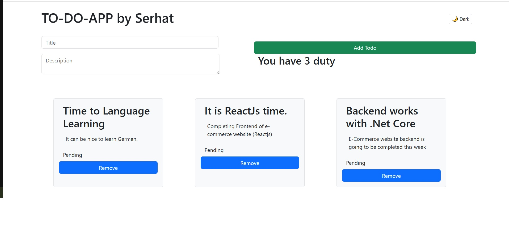
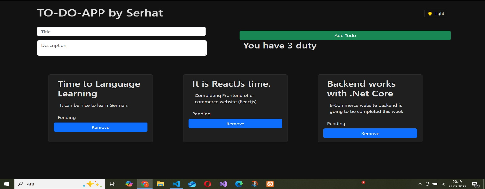

<<<<<<< HEAD
# 📝 React Todo App

A simple, modern, and user-friendly Todo application built with React. This project is designed to practice and demonstrate core React concepts such as components, state management, props, `useEffect`, and localStorage.

## 🚀 Live Demo

👉 [View Live App](https://your-deployment-link.com) _(replace with your actual link)_

---

## 📸 Screenshot




---

## 🔧 Features

- 🆕 Add new tasks
- ✅ Mark tasks as complete
- ❌ Delete tasks
- 💾 Persistent data using localStorage
- 🌓 Light / Dark theme toggle _(if implemented)_
- ⏰ Task creation timestamp

---

## 🛠️ Tech Stack

- [React](https://reactjs.org/)
- JavaScript (ES6+)
- HTML5 / CSS3
- LocalStorage
- Create React App

---

## 📁 Getting Started

```bash
# Clone the repository
git clone https://github.com/your-username/todo-app.git

# Navigate to the project directory
cd todo-app

# Install dependencies
npm install

# Start the development server
npm start
```
=======
# todo-app
React todo app
>>>>>>> 4163253d215084dc74e333a9f6a3eb61479f856d
